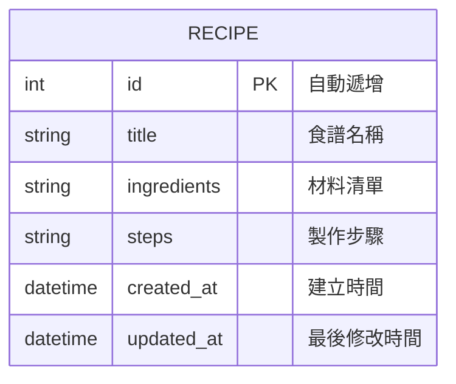

# 資料庫設計 (DB Design)

這份文件記錄了本系統（食譜收藏夾）的資料結構，採用 SQLite，以最輕量的方式保留擴充彈性。

## ER 圖（實體關係圖）

## 資料表詳細說明

### `recipes` 資料表

用來儲存使用者的食譜清單。每一道料理的詳細屬性都記錄在這裡。

| 欄位名稱 | 型別 | 必填 | 預設值 | 說明 |
| :--- | :--- | :--- | :--- | :--- |
| `id` | INTEGER | 是 (PK) | AUTOINCREMENT | 唯一識別代碼 |
| `title` | TEXT | 是 | 無 | 食譜的名稱，例如「紅燒肉」 |
| `ingredients` | TEXT | 是 | 無 | 所需材料與份量，可支援換行 |
| `steps` | TEXT | 是 | 無 | 料理製作步驟，可支援換行 |
| `created_at` | DATETIME | 否 | CURRENT_TIMESTAMP | 該筆食譜的建立時間 |
| `updated_at` | DATETIME | 否 | CURRENT_TIMESTAMP | 該筆食譜最新一次的修改時間 |

> **說明**：未來如果需要擴充「標籤分類」或是「圖片上傳」等 Nice to Have 規格，可以直接對這個表增加 `category` 或 `image_path` 欄位。
